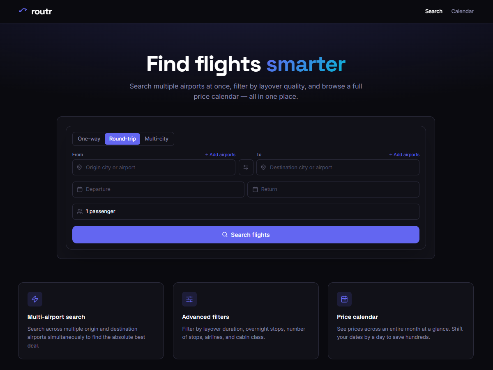
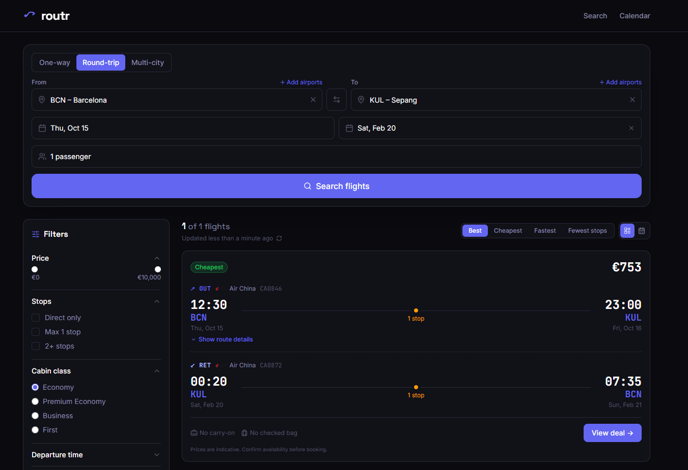

<div align="center">

# Routr

**Flight search reimagined**


[](https://routr-rosy.vercel.app)

</div>

---





---

## Overview

Routr is a flight search interface built on the [Duffel API](https://duffel.com/) that lets you search across multiple origin and destination airports simultaneously — something most flight search engines don't support. Filter by layover duration, number of stops, cabin class, and airlines. Browse a full price calendar to shift dates by a day and save hundreds.

## Features

- **Multi-airport search** — search from/to multiple airports in one query (e.g. BCN + MAD → KUL + SIN)
- **Advanced filters** — layover duration, overnight stops, number of stops, airlines, cabin class
- **Price calendar** — browse prices across an entire month at a glance
- **Open-jaw routing** — fly into one city, return from another
- **Redis caching** — Upstash Redis caches API responses to reduce latency and API cost
- **One-way, round-trip, multi-city** — all three search modes supported

## Stack

| Layer | Technology |
|-------|-----------|
| Framework | Next.js (App Router) |
| Language | TypeScript |
| Flight data | Duffel API |
| Caching | Upstash Redis |
| Hosting | Vercel |

## Local Development

```bash
npm install
cp .env.example .env.local
# Fill in: DUFFEL_API_KEY, UPSTASH_REDIS_REST_URL, UPSTASH_REDIS_REST_TOKEN
npm run dev
```

Open [http://localhost:3000](http://localhost:3000).

## Environment Variables

```env
DUFFEL_API_KEY=
UPSTASH_REDIS_REST_URL=
UPSTASH_REDIS_REST_TOKEN=
```

---

<div align="center">
  <a href="https://routr-rosy.vercel.app">Live ↗</a> · <a href="https://github.com/DavidSerret">@DavidSerret</a>
</div>
